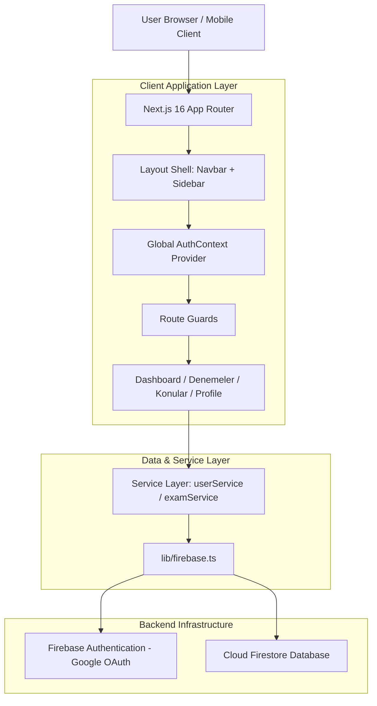

# High-Level Technical Architecture

## 1. Architectural Overview

`YKS Koçu` is built following modern web application design patterns using **Next.js 16 (App Router)**, **React 19**, **TypeScript**, **Tailwind CSS v4**, and **Firebase (Auth & Firestore)**.

---

## 2. Layer Definitions

### 1. Presentation & Routing Layer (`app/`)
- Uses Next.js App Router for file-system based routing and layouts.
- Root layout (`app/layout.tsx`) embeds fonts (`Geist`), global styles (`globals.css`), and the top-level `AuthProvider`.
- Route groups `(dashboard)` encapsulate authenticated feature routes cleanly under a common navigation frame.

### 2. UI Component Library (`components/`)
- **`components/ui/`**: Reusable low-level atomic components (Button, Input, Card, Modal, Select, Progress, Badge, Tabs).
- **`components/layout/`**: Application shell structure (Navbar, Sidebar, UserMenu, PageHeader).
- **`components/auth/`**: Auth guards and login screens.
- **`components/deneme/`**: Exam entry forms, section cards, score tables, and charts.

### 3. State & Context Layer (`context/`)
- **`AuthContext.tsx`**: Provides global user authentication state (`user`, `loading`, `error`, `logout`) managed via Firebase `onAuthStateChanged`.

### 4. Service Layer (`services/`)
- Abstraction layer decoupling direct Firestore API calls from React components:
  - `userService.ts`: Handles profile creation, fetching, and target updates.
  - `examService.ts`: Handles exam score logging, net calculations, and historical queries.

---

## 3. Data Flow & Security Principles

1. **Unidirectional Data Flow**: Components invoke Service functions $\rightarrow$ Services execute Firebase API calls $\rightarrow$ Firestore returns promises/listeners $\rightarrow$ React state updates UI.
2. **Environment Variable Security**: All Firebase parameters are loaded exclusively via `process.env.NEXT_PUBLIC_FIREBASE_...` to ensure zero key exposure in tracked source repositories.
3. **Type Safety**: Strictly enforced TypeScript interfaces (`types/user.ts`, `types/exam.ts`) across all application layers.
