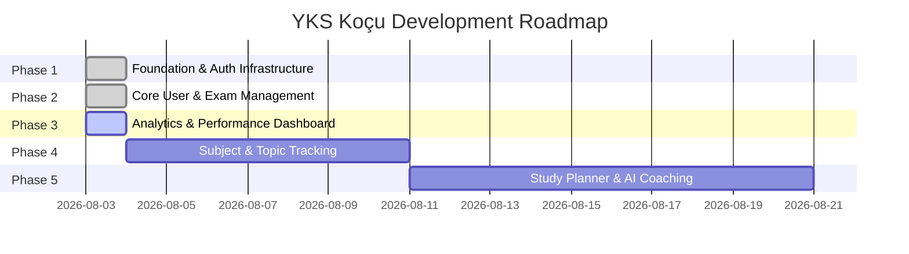

# Multi-Phase Product Development Roadmap

## Project Roadmap Overview

The development of **YKS Koçu** is organized into 5 structured, sequential phases. Every phase builds upon the previous one without breaking existing functionality or rewriting working code.

---

## Phase 1: Architecture & Foundation Infrastructure 🟢 (Complete)
- Secured environment configuration, `AuthContext`, `ProtectedRoute`, and App Layout Shell.

## Phase 2: Core User & Exam Management 🟢 (Complete)
- Student profile targets, multi-track practice exam logger ($D - Y/4$), exam history, edit/delete routes.

## Phase 3: Analytics & Performance Dashboard 🟢 (Current Focus - Complete)
- **Goals**: Dashboard view, YKS countdown, SVG net progression line charts, section bar charts, progress donut, daily/weekly/monthly study goal tracking.

## Phase 4: Subject & Topic Mastery Tracking (Konu Takibi)
- Curriculum topic checklist and topic mastery status toggles (`Tamamlandı`, `Tekrar Edilecek`, `Başlanmadı`).

## Phase 5: Study Planner & AI Coaching
- Weekly schedule manager, pomodoro timer, and AI recommendations.
