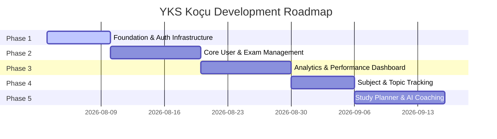

# Multi-Phase Product Development Roadmap

## Project Roadmap Overview

The development of **YKS Koçu** is organized into 5 structured, sequential phases. Every phase builds upon the previous one without breaking existing functionality or rewriting working code.

---

## Phase 1: Architecture & Foundation Infrastructure 🟢 (Current Focus)

- **Goals**: Secure environment configuration, build persistent authentication context, define TypeScript contracts, and construct the application shell layout.
- **Key Tasks**:
  1. Refactor `lib/firebase.ts` to use `.env.local` variables.
  2. Create `context/AuthContext.tsx` with `onAuthStateChanged` session listener.
  3. Define data contracts in `types/user.ts` and `types/exam.ts`.
  4. Create application navigation shell (`Navbar`, `Sidebar`, `UserMenu`).
  5. Wrap `app/layout.tsx` with `AuthProvider` and navigation layout.

---

## Phase 2: Core User & Exam Management

- **Goals**: Complete profile management, dynamic multi-track practice exam logging, and history management.
- **Key Tasks**:
  1. Implement `app/profile/page.tsx` with target department/ranking editor.
  2. Build `/denemeler/ekle` page supporting all YKS tracks (`Sayısal`, `Eşit Ağırlık`, `Sözel`, `Dil`).
  3. Implement automatic Net calculation ($D - \frac{Y}{4}$) with validation rules.
  4. Build practice exam history list (`/denemeler`) with filtering options.

---

## Phase 3: Analytics & Performance Dashboard

- **Goals**: Visual analytics, net trend progression charts, and YKS target gap simulation.
- **Key Tasks**:
  1. Build `/dashboard` overview with YKS Countdown timer.
  2. Integrate interactive line and bar charts (Recharts / Chart.js) for score trends.
  3. Implement Target Gap Comparison widget (Current Avg vs Needed Net).

---

## Phase 4: Subject & Topic Mastery Tracking (Konu Takibi)

- **Goals**: Complete YKS curriculum topic checklist and progress tracking.
- **Key Tasks**:
  1. Create `/konular` page with full OSYM YKS topic breakdown per subject.
  2. Implement topic status toggles (`Tamamlandı`, `Tekrar Edilecek`, `Başlanmadı`).
  3. Persist topic states to Firestore `users/{uid}/topic_progress`.

---

## Phase 5: Study Planner & AI Coaching

- **Goals**: Weekly schedule manager, pomodoro timer, and AI-assisted coaching.
- **Key Tasks**:
  1. Create `/program` schedule manager and pomodoro session logger.
  2. Integrate Firebase AI Logic (Gemini API) to analyze net performance and suggest personalized study goals.
